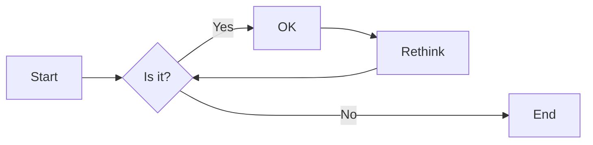
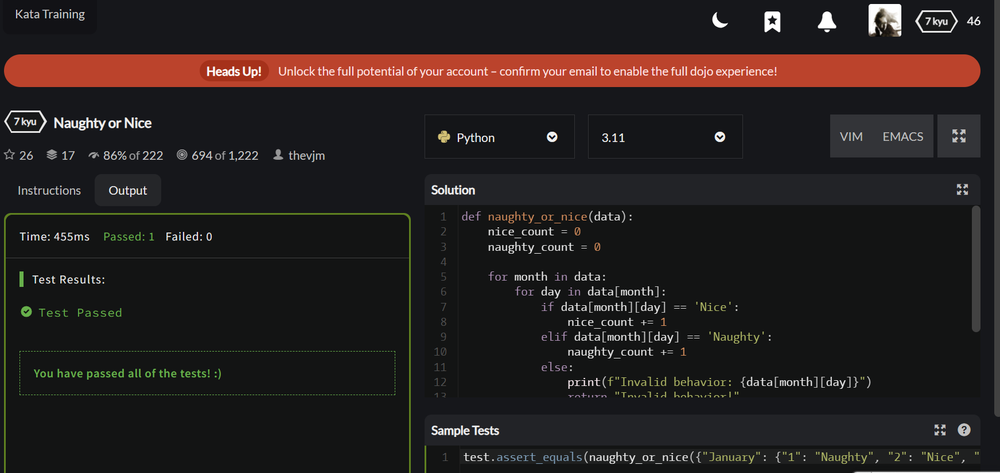
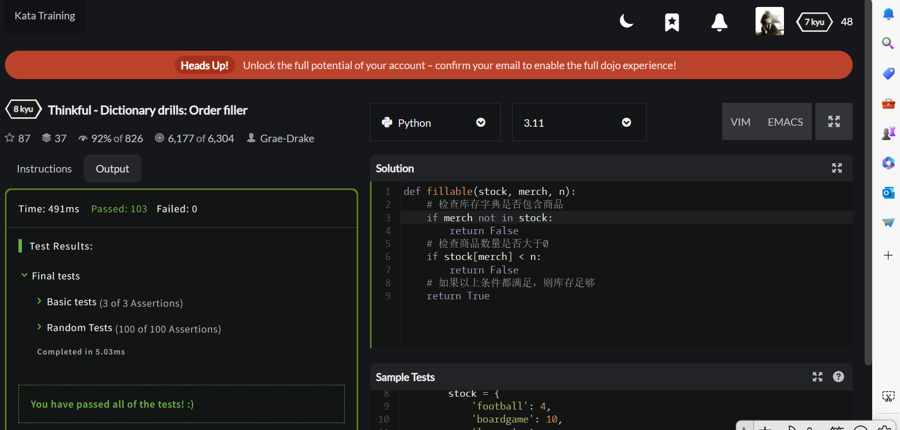
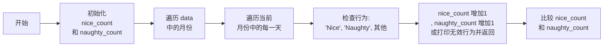

# 实验四 Python字典和while循环

班级： 21计科2

学号： B20210302232

姓名： 闫新宇

Github地址：<https://github.com/yanxinyvvv/syfour.git>

CodeWars地址：<https://www.codewars.com/users/闫新宇>

---

## 实验目的

1. 学习Python字典
2. 学习Python用户输入和while循环

## 实验环境

1. Git
2. Python 3.10
3. VSCode
4. VSCode插件

## 实验内容和步骤

### 第一部分

Python列表操作

完成教材《Python编程从入门到实践》下列章节的练习：

- 第6章 字典
- 第7章 用户输入和while循环

---

### 第二部分

在[Codewars网站](https://www.codewars.com)注册账号，完成下列Kata挑战：

---

#### 第一题：淘气还是乖孩子（Naughty or Nice）

难度： 7kyu

圣诞老人要来镇上了，他需要你帮助找出谁是淘气的或善良的。你将会得到一整年的JSON数据，按照这个格式：

```python
{
    January: {
        '1': 'Naughty','2': 'Naughty', ..., '31': 'Nice'
    },
    February: {
        '1': 'Nice','2': 'Naughty', ..., '28': 'Nice'
    },
    ...
    December: {
        '1': 'Nice','2': 'Nice', ..., '31': 'Naughty'
    }
}
```

你的函数应该返回 "Naughty!"或 "Nice!"，这取决于在某一年发生的总次数（以较大者为准）。如果两者相等，则返回 "Nice！"。
代码提交地址：
<https://www.codewars.com/kata/5662b14e0a1fb8320a00005c>

---

#### 第二题： 观察到的PIN（The observed PIN）

难度：4kyu

好了，侦探，我们的一个同事成功地观察到了我们的目标人物，抢劫犯罗比。我们跟踪他到了一个秘密仓库，我们认为在那里可以找到所有被盗的东西。这个仓库的门被一个电子密码锁所保护。不幸的是，我们的间谍不确定他看到的密码，当罗比进入它时。

键盘的布局如下：

```python
┌───┬───┬───┐
│ 1 │ 2 │ 3 │
├───┼───┼───┤
│ 4 │ 5 │ 6 │
├───┼───┼───┤
│ 7 │ 8 │ 9 │
└───┼───┼───┘
    │ 0 │
    └───┘
```

他注意到密码1357，但他也说，他看到的每个数字都有可能是另一个相邻的数字（水平或垂直，但不是对角线）。例如，代替1的也可能是2或4。而不是5，也可能是2、4、6或8。

他还提到，他知道这种锁。你可以无限制地输入错误的密码，但它们最终不会锁定系统或发出警报。这就是为什么我们可以尝试所有可能的（*）变化。

*可能的意义是：观察到的PIN码本身和考虑到相邻数字的所有变化。

你能帮助我们找到所有这些变化吗？如果有一个函数，能够返回一个列表，其中包含一个长度为1到8位的观察到的PIN的所有变化，那就更好了。我们可以把这个函数命名为getPINs（在python中为get_pins，在C#中为GetPINs）。

但请注意，所有的PINs，包括观察到的PINs和结果，都必须是字符串，因为有可能会有领先的 "0"。我们已经为你准备了一些测试案例。
侦探，我们就靠你了!
代码提交地址：
<https://www.codewars.com/kata/5263c6999e0f40dee200059d>

---

#### 第三题： RNA到蛋白质序列的翻译（RNA to Protein Sequence Translation）

难度：6kyu

蛋白质是由DNA转录成RNA，然后转译成蛋白质的中心法则。RNA和DNA一样，是由糖骨架（在这种情况下是核糖）连接在一起的长链核酸。每个由三个碱基组成的片段被称为密码子。称为核糖体的分子机器将RNA密码子转译成氨基酸链，称为多肽链，然后将其折叠成蛋白质。

蛋白质序列可以像DNA和RNA一样很容易地可视化，作为大字符串。重要的是要注意，“停止”密码子不编码特定的氨基酸。它们的唯一功能是停止蛋白质的转译，因此它们不会被纳入多肽链中。“停止”密码子不应出现在最终的蛋白质序列中。为了节省您许多不必要（和乏味）的键入，已为您的氨基酸字典提供了键和值。

给定一个RNA字符串，创建一个将RNA转译为蛋白质序列的函数。注意：测试用例将始终生成有效的字符串。

```python
protein（'UGCGAUGAAUGGGCUCGCUCC'）
```

将返回`CDEWARS`

作为测试用例的一部分是一个真实世界的例子！最后一个示例测试用例对应着一种叫做绿色荧光蛋白的蛋白质，一旦被剪切到另一个生物体的基因组中，像GFP这样的蛋白质可以让生物学家可视化细胞过程！

Amino Acid Dictionary

```python
   # Your dictionary is provided as PROTEIN_DICT
   PROTEIN_DICT = {
    # Phenylalanine
    'UUC': 'F', 'UUU': 'F',
    # Leucine
    'UUA': 'L', 'UUG': 'L', 'CUU': 'L', 'CUC': 'L', 'CUA': 'L', 'CUG': 'L',
    # Isoleucine
    'AUU': 'I', 'AUC': 'I', 'AUA': 'I',
    # Methionine
    'AUG': 'M',
    # Valine
    'GUU': 'V', 'GUC': 'V', 'GUA': 'V', 'GUG': 'V',
    # Serine
    'UCU': 'S', 'UCC': 'S', 'UCA': 'S', 'UCG': 'S', 'AGU': 'S', 'AGC': 'S',
    # Proline
    'CCU': 'P', 'CCC': 'P', 'CCA': 'P', 'CCG': 'P',
    # Threonine
    'ACU': 'T', 'ACC': 'T', 'ACA': 'T', 'ACG': 'T',
    # Alanine
    'GCU': 'A', 'GCC': 'A', 'GCA': 'A', 'GCG': 'A',
    # Tyrosine
    'UAU': 'Y', 'UAC': 'Y',
    # Histidine
    'CAU': 'H', 'CAC': 'H',
    # Glutamine
    'CAA': 'Q', 'CAG': 'Q',
    # Asparagine
    'AAU': 'N', 'AAC': 'N',
    # Lysine
    'AAA': 'K', 'AAG': 'K',
    # Aspartic Acid
    'GAU': 'D', 'GAC': 'D',
    # Glutamic Acid
    'GAA': 'E', 'GAG': 'E',
    # Cystine
    'UGU': 'C', 'UGC': 'C',
    # Tryptophan
    'UGG': 'W',
    # Arginine
    'CGU': 'R', 'CGC': 'R', 'CGA': 'R', 'CGG': 'R', 'AGA': 'R', 'AGG': 'R',
    # Glycine
    'GGU': 'G', 'GGC': 'G', 'GGA': 'G', 'GGG': 'G',
    # Stop codon
    'UAA': 'Stop', 'UGA': 'Stop', 'UAG': 'Stop'
}
```

代码提交地址：
<https://www.codewars.com/kata/555a03f259e2d1788c000077>

---

#### 第四题： 填写订单（Thinkful - Dictionary drills: Order filler）

难度：8kyu

您正在经营一家在线业务，您的一天中很大一部分时间都在处理订单。随着您的销量增加，这项工作占用了更多的时间，不幸的是最近您遇到了一个情况，您接受了一个订单，但无法履行。

您决定写一个名为`fillable()`的函数，它接受三个参数：一个表示您库存的字典`stock`，一个表示客户想要购买的商品的字符串`merch`，以及一个表示他们想购买的商品数量的整数n。如果您有足够的商品库存来完成销售，则函数应返回`True`，否则应返回`False`。

有效的数据将始终被传入，并且n将始终大于等于1。

代码提交地址：
<https://www.codewars.com/kata/586ee462d0982081bf001f07/python>

---

#### 第五题： 莫尔斯码解码器（Decode the Morse code, advanced）

难度： 4kyu

在这个作业中，你需要为有线电报编写一个莫尔斯码解码器。
有线电报通过一个有按键的双线路运行，当按下按键时，会连接线路，可以在远程站点上检测到。莫尔斯码将每个字符的传输编码为"点"（按下按键的短按）和"划"（按下按键的长按）的序列。

在传输莫尔斯码时，国际标准规定：

- "点" - 1个时间单位长。
- "划" - 3个时间单位长。
- 字符内点和划之间的暂停 - 1个时间单位长。
- 单词内字符之间的暂停 - 3个时间单位长。
- 单词间的暂停 - 7个时间单位长。

但是，该标准没有规定"时间单位"有多长。实际上，不同的操作员会以不同的速度进行传输。一个业余人士可能需要几秒钟才能传输一个字符，一位熟练的专业人士可以每分钟传输60个单词，而机器人发射器可能会快得多。

在这个作业中，我们假设消息的接收是由硬件自动执行的，硬件会定期检查线路，如果线路连接（远程站点的按键按下），则记录为1，如果线路未连接（远程按键弹起），则记录为0。消息完全接收后，它会以一个只包含0和1的字符串的形式传递给你进行解码。

例如，消息`HEYJUDE`，即`·····−·−−··−−−··−−··`可以如下接收：

```python
1100110011001100000011000000111111001100111111001111110000000000000011001111110011111100111111000000110011001111110000001111110011001100000011
```

如您所见，根据标准，这个传输完全准确，硬件每个"点"采样了两次。

因此，你的任务是实现两个函数：

函数decodeBits(bits)，应该找出消息的传输速率，正确解码消息为点（.）、划（-）和空格（字符之间有一个空格，单词之间有三个空格），并将它们作为一个字符串返回。请注意，在消息的开头和结尾可能会出现一些额外的0，确保忽略它们。另外，如果你无法分辨特定的1序列是点还是划，请假设它是一个点。

函数decodeMorse(morseCode)，它将接收上一个函数的输出，并返回一个可读的字符串。

注意：出于编码目的，你必须使用ASCII字符.和-，而不是Unicode字符。

莫尔斯码表已经预加载给你了（请查看解决方案设置，以获取在你的语言中使用它的标识符）。

```python
morseCodes(".--")  #to access the morse translation of ".--"
```

下面是Morse码支持的完整字符列表：

```javascript
A    ·–
B    –···
C    –·–·
D    –··
E    ·
F    ··–·
G    ––·
H    ····
I    ··
J    ·–––
K    –·–
L    ·–··
M    ––
N    –·
O    –––
P    ·––·
Q    ––·–
R    ·–·
S    ···
T    –
U    ··–
V    ···–
W    ·––
X    –··–
Y    –·––
Z    ––··
0    –––––
1    ·––––
2    ··–––
3    ···––
4    ····–
5    ·····
6    –····
7    ––···
8    –––··
9    ––––·
.    ·–·–·–
,    ––··––
?    ··––··
'    ·––––·
!    –·–·––
/    –··–·
(    –·––·
)    –·––·–
&    ·–···
:    –––···
;    –·–·–·
=    –···–
+    ·–·–·
-    –····–
_    ··––·–
"    ·–··–·
$    ···–··–
@    ·––·–·
```

代码提交地址：
<https://www.codewars.com/kata/decode-the-morse-code-advanced>

---

### 第三部分

使用Mermaid绘制程序流程图

安装VSCode插件：

- Markdown Preview Mermaid Support
- Mermaid Markdown Syntax Highlighting

使用Markdown语法绘制你的程序绘制程序流程图（至少一个），Markdown代码如下：


显示效果如下：



查看Mermaid流程图语法-->[点击这里](https://mermaid.js.org/syntax/flowchart.html)

使用Markdown编辑器（例如VScode）编写本次实验的实验报告，包括[实验过程与结果](#实验过程与结果)、[实验考查](#实验考查)和[实验总结](#实验总结)，并将其导出为 **PDF格式** 来提交。

## 实验过程与结果

### 第一部分 Python列表操作和if语句

**练习6.1：** 人：使用一个字典来存储一个人的信息，包括名、姓、年龄和居住的城市。该字典应包含键first_name、last_name、age和city。将存储在该字典中的每项信息都打印出来。
```python
people={'first_name':'张','last_name':'三','age':20,'city':'长沙'}
print(people)
```

**练习6.2：** 喜欢的数1：使用一个字典来存储一些人喜欢的数。请想出5个人的名字，并将这些名字用作字典中的键。再想出每个人喜欢的一个数，并将这些数作为值存储在字典中。打印每个人的名字和喜欢的数。为了让这个程序更有趣，通过询问朋友确保数据是真实的。
```python
people={'张三':8,'李四':1,'王五':6,'赵六':5,'刘七':9}
for key,value in people.items():
    print(str(key)+"最喜欢的数字是"+str(value))
```

**练习6.3：** 词汇表1：Python字典可用于模拟现实生活中的字典。为避免混淆，我们将后者称为词汇表。①想出你在前面学过的5个编程术语，将它们用作词汇表中的键，并将它们的含义作为值存储在词汇表中。②以整洁的方式打印每个术语及其含义。为此，既可以先打印术语，在它后面加上一个冒号，再打印其含义；也可以先在一行里打印术语，再使用换行符(\n)插入一个空行，然后在下一行里以缩进的方式打印其含义。
```python
bc={'for':'循环','list':'列表','array':'数组','dist':'字典','print':'输出'}
for key,value in bc.items():
    print(str(key)+":"+str(value))
```

**练习6.5：** 河流：创建一个字典，在其中存储三条河流及其流经的国家。例如，一个键值对可能是'nile'：'egypt’。①使用循环为每条河流打印一条消息，如下所示：The Nile runs through Egypt.②使用循环将该字典中每条河流的名字打印出来。③使用循环将该字典包含的每个国家的名字打印出来。
```python
hl={'nile':'egypt','Amazon River':'Brazil','changjiang':'China'}
for key,value in hl.items():
    print("The "+key.title()+" runs through "+value.title())
for key in hl.keys():
    print(key.title())
for value in hl.values():
    print(value.title())
```

**练习6.6：** 调查：在6.3.1节编写的程序favorite_languages.py中执行以下操作。①创建一个应该会接受调查的人的名单，其中有些人已在字典中，而其他人不在字典中。②遍历这个名单。对于已参与调查的人，打印一条消息表示感谢；对于还未参与调查的人，打印一条邀请参加调查的消息。
```python
favorite_languages={'jen':'python','sarah':'c','edward':'ruby','phil':'python'}
people=['jen','sarah','ruby','phil']
for key,value in favorite_languages.items():
    if key in people:
        print(key+",thank your welcome")
    else:
        print(key+",please take our poil")
```

**练习6.7：** 人们：在为练习6.1编写的程序中，再创建两个表示人的字典，然后将这三个半典都存储在一个名为people的列表中。遍历这个列表，将其中每个人的所有信息都打印出来。
```python
people1={'first_name':'张','last_name':'三','age':22,'city':'长沙'}
people2={'first_name':'李','last_name':'四','age':20,'city':'北京'}
people3={'first_name':'王','last_name':'五','age':18,'city':'上海'}
people=[people1,people2,people3]
for t in people:
    for key,value in t.items():
        print(key+":"+str(value))
    print()
```

**练习6.8：** 宠物：创建多个表示宠物的字典，每个字典都包含宠物的类型及其主人的名字。将这些字典存储在一个名为pets 的列表中，再遍历该列表，并将有关每个宽物的所有信息打印出来。
```python
cat={'name':'cat','type':'猫科','owner':'张三'}
dog={'name':'dog','type':'犬科','owner':'李四'}
pig={'name':'pig','type':'哺乳类','owner':'王五'}
bird={'name':'bird','type':'鸟类','owner':'刘六'}
pets=[cat,dog,pig,bird]
for pet in pets:
    for key,value in pet.items():
        print(key+":"+str(value))
    print()
```

**练习6.9：** 喜欢的地方：创建一个名为favorite_places的字典。在这个字典中，将三个人的名字用作键，并存储每个人喜欢的1～3个地方。为让这个练习更有趣些，让一些朋友说出他们喜欢的几个地方。遍历这个字典，并将其中每个人的名字及其喜欢的地方打印出来。
```python
张三=['长沙','北京','上海']
李四=['杭州','苏州']
王五=['西安','武汉']
favorite_places={'张三':张三,'李四':李四,'王五':王五}
for fpk,fpv in favorite_places.items():
    print(fpk+"最喜欢的地方是:")
    for v in fpv:
        print(v)
    print()
```

**练习6.10：** 喜欢的数2：修改为练习6.2编写的程序，让每个人都可以有多个喜欢的数字，然后将每个人的名字及其喜欢的数打印出来。
```python
张三=[7,8]
李四=[6,4,5]
王五=[1,9,2]
pn={'张三':张三,'李四':李四,'王五':王五}
for pk,pv in pn.items():
    print(pk+"最喜欢的数字是:")
    for v in pv:
        print(v)
    print()
```

**练习6.11：** 城市：创建一个名为cities的字典，将三个城市名用作键。对于每座城市，都创建一个字典，并在其中包含该城市所属的国家、人口约数以及一个有关该城市的事实。表示每座城市的字典都应包含country、population和fact等键。将每座城市的名字以及相关信息都打印出来。
```python
city1={'country':'c1','population':'p1','fact':'f1'}
city2={'country':'c2','population':'p2','fact':'f2'}
city3={'country':'c3','population':'p3','fact':'f3'}
cities={'city1':city1,'city2':city2,'city3':city3}
for ck,cv in cities.items():
    print(ck)
    for cvk,cvv in cv.items():
        print(cvk+":"+cvv)
    print()
```

**练习7.1：** 汽车租赁：编写一个程序，询问用户要租什么样的汽车，并打印一条消息，如下所示：Let me see if I can find you a Subaru.
```python
message=input("What car do you need to rent?")
print("Let me see if I can find you a "+message)
```

**练习7.2：** 餐馆订位：编写一个程序，询问用户有多少人用餐。如果超过8个人，就打印一条消息，指出没有空桌；否则指出有空桌。
```python
message=input("How many people are there to eat?")
if int(message)>8:
    print("No empty table")
else:
    print("There is a table for you to dine")
```

**练习7.3：** 10的整数倍：让用户输入一个数，并指出这个数是否是10的整数倍。
```python
message=input("please input a number")
if int(message)%10==0:
    print("This number is an integer multiple of ten")
else:
    print("This number isn't an integer multiple of ten")
```

**练习7.4：** 比萨配料：编写一个循环，提示用户输入一系列比萨配料，并在用户输入'quit'时结束循环。每当用户输入一种配料后，都打印一条消息，指出要在比萨中添加这种配料。
```python
ps="Please enter pizza ingredients\nEnter 'quit' to end"
flag=True
while flag:
    message=input(ps)
    if message=='quit':
        break
    else:
        print("We have added ingredients "+message)
```

**练习7.5：** 电影票：有家电影院根据观众的年龄收取不同的票价：不到3岁的观众免费；3(含)～12岁的观众收费10美元；年满12岁的观众收费15美元。请编写一个循环，在其中询问用户的年龄，并指出其票价。
```python
dy="Please enter your age\nEnter 'quit' to end"
flag=True
while flag:
    message=input(dy)
    if message=='quit':
        break
    else:
        if int(message)<3:
            print("You watch the movie for free")
        elif int(message)>=3 and int(message)<=12:
            print("It costs $10 to watch a movie")
        else:
            print("It costs $15 to watch a movie.")
```

**练习7.7：** 无限循环：编写一个没完没了的循环，并运行它。(要结束该循环，可按Ctrl+C，也可关闭显示输出的窗口。)
```python
while True:
    print("onetwothree")
```

**练习7.8：** 熟食店：创建一个名为sandwich_orders 的列表，其中包含各种三明治的名字，再创建一个名为finished_sandwiches的空列表。遍历列表sandwich_orders，对于其中的每种三明治，都打印一条消息，如“I made your tuna sandwich.”，并将其移到列表 finished_sandwiches中。当所有三明治都制作好后，打印一条消息，将这些三明治列出来。
```python
sandwich_orders=['s1','s2','s3']
finish_sandwiches=[]
while sandwich_orders:
    tt=sandwich_orders.pop()
    print("I make your "+tt+" sandwich")
    finish_sandwiches.append(tt)
print("finish_sandwiches:")
for t in finish_sandwiches:
    print(t)
```

**练习7.9：** 五香烟熏牛肉卖完了：使用为练习7.8创建的列表 sandwich_orders，并确保'pastrami'在其中至少出现了三次。在程序开头附近添加这样的代码：先打印一条消息，指出熟食店的五香烟熏牛肉(pastrami)卖完了；再使用一个while 循环将列表sandwich_orders中的'pastrami'都删除。确认最终的列表finished_sandwiches 中未包含'pastrami'。
```python
sandwich_orders=['s1','pastrami','s2','pastrami','s3','pastrami']
print(sandwich_orders)
while 'pastrami' in sandwich_orders:
    sandwich_orders.remove('pastrami')
print("The pastrami is sold out")
print(sandwich_orders)
```

**练习7.10：** 梦想中的度假胜地 编写一个程序，调查用户梦想中的度假胜地。使用类似于“If you could visit one place in the world, where would you go?”的提示，并编写一个打印调查结果的代码块。
```python
responses={}
flag=True
while flag:
    name=input("what's your name?")
    response=input("If you could visit one place in the world,where would you go?")
    responses[name]=response
    repeat=input("would you like to let another person respond?(yes/no)")
    if repeat=="no":
        flag=False
print("\n--Result--")
for name,response in responses.items():
    print(name+" want go to "+response)
```

### 第二部分 Codewars Kata挑战

**第1题：淘气还是乖孩子（Naughty or Nice）**
```python
def naughty_or_nice(data):  
    nice_count = 0  
    naughty_count = 0  
    for month in data:  
        for day in data[month]:  
            if data[month][day] == 'Nice':  
                nice_count += 1  
            elif data[month][day] == 'Naughty':  
                naughty_count += 1  
            else:  
                print(f"Invalid behavior: {data[month][day]}")  
                return "Invalid behavior!"  
    if nice_count > naughty_count:  
        return "Nice!"  
    elif nice_count < naughty_count:  
        return "Naughty!"  
    else:  
        return "Nice!"
```
**运行结果**


**第4题：填写订单（Thinkful - Dictionary drills: Order filler）**
```python
def fillable(stock, merch, n):  
    # 检查库存字典是否包含商品  
    if merch not in stock:  
        return False  
    # 检查商品数量是否大于0  
    if stock[merch] < n:  
        return False  
    # 如果以上条件都满足，则库存足够，返回True  
    return True
```
**运行结果**


### 第三部分 使用Mermaid绘制程序流程图

**第1题：淘气还是乖孩子（Naughty or Nice）**
```
flowchart LR  
A[开始] --> B[初始化 \nnice_count\n 和 naughty_count]  
B --> C[遍历 data\n 中的月份]  
C --> D[遍历当前\n月份中的每一天]  
D --> E[检查行为: \n'Nice', 'Naughty', 其他]  
E --> F[nice_count 增加1\n, naughty_count 增加1 \n或打印无效行为并返回]  
F --> G[比较 nice_count \n和 naughty_count]
```



## 实验考查

1.字典的键和值有什么区别？
<br />①字典中的键必须是唯一的，这有助于确保数据的一致性。值则不必是唯一的，一个键可以与多个不同的值相关联；②字典中的键必须是不可变的，通常为字符串、数字或元组，以便在字典中查找和访问。值可以是任何可变或不可变的Python对象；③键用于访问字典中的值，可以通过提供键来检索与之相关联的值。④每个键都与一个值相关联，这种关联性构成了字典中的键值对，这种关联性是通过键来索引值的；⑤字典是一种通过键引用值的数据结构，这是一种映射类型，可以将键看作是值的引用或索引。

2.在读取和写入字典时，需要使用默认值可以使用什么方法？
<br />可以使用字典的 get() 方法来读取字典的值，如果指定的键不存在于字典中，则返回一个默认值。可以使用 dict.setdefault() 方法来写入字典的值，如果指定的键不存在于字典中，则添加该键并将值设置为默认值。

3.Python中的while循环和for循环有什么区别？
<br />①while循环通常用于当条件为真时反复执行某个代码块，而for循环则通常用于遍历一个序列（列表，元组，字典，字符串）或其他可迭代对象；②while循环会反复执行代码块，直到条件不再满足，在每次循环开始时，都会检查条件。而for循环则会一次性遍历序列中的所有元素。

4.阅读[PEP 636 – Structural Pattern Matching: Tutorial](https://peps.python.org/pep-0636/), 总结Python 3.10中新出现的match语句的使用方法。
<br />使用方法：①match语句需要在函数中使用，且必须是函数中的第一个语句；②match语句后面跟着要匹配的对象，可以是变量、表达式或任何可评估为可匹配对象的东西；③match语句可以匹配对象的类型、值或其他属性；④如果匹配成功，则执行相应的代码块；如果匹配失败，则继续执行下一个分支或结束匹配。

## 实验总结
通过实验，我了解了字典的基本概念和特点，包括字典中的键必须是唯一的，值则不必是唯一的，一个键可以与多个不同的值相关联；字典中的键必须是不可变的，通常为字符串、数字或元组，以便在字典中查找和访问；值可以是任何可变或不可变的Python对象；每个键都与一个值相关联，这种关联性构成了字典中的键值对，这种关联性是通过键来索引值的。还学习了如何使用字典的get()方法和dict.setdefault()方法来读取和写入字典的值，以及使用while循环和for循环来遍历字典。通过实验，rangw 我对Python中的字典有了更深入的了解,在实验中遇到的问题也通过询问老师、同学得到解决。